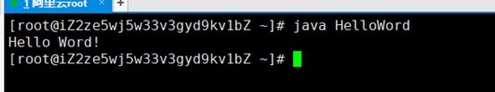

# MySQL的安装

## 1、确认CentOS版本

## 

## 2、下载系统版本对应的MySQL源

https://dev.mysql.com/downloads/repo/yum/ 


## 3、使用Xftp将加载文件上传至服务器的root目录


## 4、安装MySQL源

```shell
rpm -Uvh mysql80-community-release-el8-1.noarch.rpm 
```


安装完成后可以在

```shell
/etc/yum.repos.d/
```

目录下找到下面两个文件


## 5、安装MySQL

```shell
yum install mysql-server 
```

输入y等待系统自动下载


安装完毕


## 6、启动MySQL

```shell
systemctl start mysqld.service
```


## 7、进入MySQL

```shell
mysql -uroot -p
```

第一次登录无密码，直接回车


修改密码：

```mysql
alter user 'root'@'localhost' IDENTIFIED BY '123456';
```


立即刷新：

```mysql
FLUSH PRIVILEGES;
```


## 8、测试密码是否修改成功

先exit退出MySQL，再使用修改后的密码重新登录


## 9、设置远程登录

一般来说，进行远程登录不应该使用root用户，所以我们创建一个账号

//创建新用户

```mysql
create user mysql_user;
```

//授权，% 表示是所有的外部机器，如果指定某一台机，就将%改为相应的机器名

```mysql
GRANT ALL ON *.* TO 'mysql_user'@'%';
```

//更新密码

```mysql
ALTER USER 'mysql_user'@'%' IDENTIFIED WITH mysql_native_password BY 'xxx';
```

//刷新

```mysql
flush privileges;
```


## 10、确保3306端口开启

```shell
netstat -an | grep 3306
```

LISTEN表示端口已经开启


如果没有开启，打开云服务器控制台配置安全组规则，添加3306端口，授权对象0.0.0.0/0


## 11、使用Navicat远程连接数据库

打开Navicat首页点击连接选择MySQL


登录


连接名随意，本地标识

主机填写服务器ip地址

用户名密码填写刚刚服务器MySQL中创建的用户名密码

完成后点击测试连接


连接成功

## 12、将本地数据库表上传到服务器

使用Navicat直接复制粘贴就好

# JDK1.8的安装

## 1、  查看JDK软件包列表

```shell
yum search java | grep jdk
```


## 2、  安装对应版本JDK

星号代表安装jdk1.8.0的所有文件

```shell
yum install -y java-1.8.0-openjdk*
```


耐心等待……


安装完毕，测试是否安装成功：

```shell
java -version
```


## 3、  配置环境变量

JDK默认安装路径

```shell
/usr/lib/jvm
```

复制最长的那个文件名（跟其他文件颜色不一样的那个）


使用vim打开配置文件：

```shell
vim /etc/profile
```


在普通模式里面输入G跳转到文件最后

输入i进入编辑模式

在最后一行添加：

```shell
JAVA_HOME=/usr/lib/jvm/java-1.8.0-openjdk-1.8.0.265.b01-0.el8_2.x86_64

PATH=$PATH:$JAVA_HOME/bin 

CLASSPATH=.:$JAVA_HOME/lib/dt.jar:$JAVA_HOME/lib/tools.jar 

export JAVA_HOME CLASSPATH PATH
```


点击Esc进入普通模式

输入:wq回车


刷新使配置的环境变量生效

```shell
source /etc/profile
```


测试环境变量是否生效

```shell
echo $JAVA_HOME

echo $PATH

echo $CLASSPATH
```


## 4、  编写第一个HelloWord

使用vim编写一个java文件：

```shell
vim HelloWord.java
```

输入i进入编辑模式


保存退出

使用

```shell
javac HelloWord.java
```

编译生成字节码文件


执行

```shell
java HelloWord
```



安装完毕

# Tomcat安装

## 1、 下载Tomcat安装压缩包

https://tomcat.apache.org/download-90.cgi


将安装压缩包使用Xftp上传到服务器


进入目录：


解压文件：

```shell
tar -zxvf apache-tomcat-9.0.39.tar.gz
```


## 2、 配置tomcat环境变量

```shell
vim /etc/profile
```

普通模式输入G跳转到最后一行

输入i进入编辑模式

输入：

```shell
export CATALINA_HOME=/usr/local/tomcat/apache-tomcat-9.0.39
```


保存退出

使配置生效

```shell
source /etc/profile
```


## 3、 启动tomcat服务器

进入tomcat的bin目录


执行startup.sh

```shell
./startup.sh
```


启动成功，测试：


# 部署war工程

## 1、  安装Alibaba Cloud Toolkit插件

插件市场直接搜索Alibaba Cloud Toolkit，重启IDEA


## 2、  完善相关配置

打开设置：


进入阿里服务器后台AccessKey管理


将对应字段填入IDEA中，并点击OK


使用工具配置主机


如图，如果前面key配置成功这里就会自动识别到云主机


Target Directory填写tomcat站点webapps目录下

```shell
/usr/local/tomcat/apache-tomcat-9.0.39/webapps
```

第二个Command是重点

```shell
sh /usr/local/sh/restart-tomcat.sh
```

在服务器tomcat安装目录得上一级目录新建一个sh文件夹，并新建一个shell脚本

并且命名为restart-tomcat.sh

并填入如下内容：

```shell
source /etc/profile

killall java

rm -rf /usr/local/tomcat/apache-tomcat-9.0.39/webapps/javademo

sh /usr/local/tomcat/apache-tomcat-9.0.39/bin/startup.sh
```


保存退出

设置系统变量：

```shell
# Get the aliases and functions

if [ -f ~/.bashrc ]; then

    . ~/.bashrc

fi
```


保存退出

## 3、  开始部署项目

回到IDEA

注意修改账户名密码，


 

选中主机并选择让项目部署的时候先clean以下，然后run


部署完成，控制台显示：


## 4、  测试


大功告成！！！